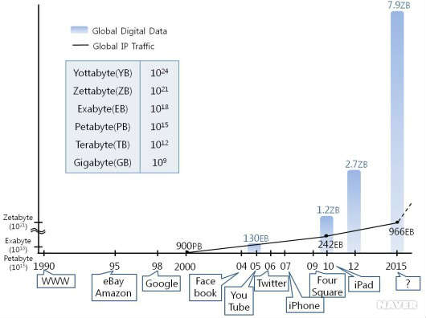
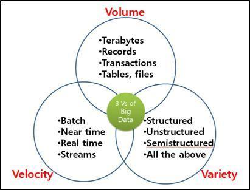
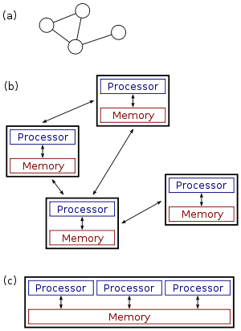
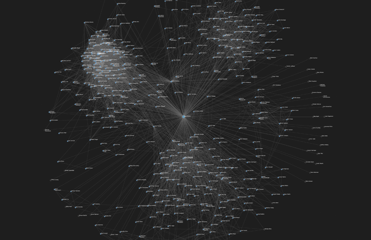

Big Data Basic
==============
기존 데이터베이스 관리도구의 능력을 넘어서 대량(수십테라바이트)의 정형 또는 테이터베이스 형태가 아닌 비정형의 데이터 집합까지 포함한 데이터로부터 가치를 추출하고 결과를 분석하는 기술이다.

## 정의
빅 데이터는 통상적으로 사용되는 데이터 수집, 관리 및 처리 소프트웨어의 수용 한계를 넘어서는 크기의 데이터를 말한다. 빅 데이터의 사이즈는 단일 데이터 집합의 크기가 끊임없이 변화하는 것이 특징이다. 또한 카트너(미국의 정보 기술 연구 및 자문 회사)의 애널리스트 더그 레이니가 빅데이터의 3요소를 정의 하였다. 빅 데이터를 이해하기 위해 3v의 이해가 필요하다.

## 빅데이터의 3대 요소(3v)
빅 데이터의 3대 요소(3v)란 크기(Volume), 속도(Velocity), 다양성(Variety)를 의미한다. 3대 요소(3v)가운데 두가지 이상만 충죽한다면 빅 데이터라고 볼 수 있다.

### 크기(Volume)

__데이터의 양__

비즈니스 특성에 따라 다를 수 있지만, 일반적으로 수십 테라 혹은 수십 페타 바이트 이상의 빅 데이터의 범위에 해당한다. 이러한 빅 데이터는 기존 파일 시스템에 저장하기 어렵다. 또한 데이터 분석을 위해서 사용하고 BI/DW 같은 솔루션에서 해결하기 어려울 정도로 급격하게 데이터 양이 증가하고 있다. 이러한 문제를 해결/극복하려면 확장 가능한 방식으로 데이터를 저장하고 분석하는 분산 컴퓨팅 방식으로 접근해야 한다. 현재 분산 컴퓨팅 솔루션에는 구글의 GFS, 아파치의 하둡 등이 있다. 대용량 병렬 처리 데이터베이스로는 EMC의 GreenPlum, HP의 Vertica, IBM의 Netezza, 테라데이터의 Kickfire 등이 있다.

※ 용어
- 분산 컴퓨팅(Distributed computing) :  인터넷에 연결된 여러 컴퓨터들의 처리 능력을 이용하여 거대한 계산 문제를 해결하려는 분산처리 모델이다.
- 병렬 컴퓨팅(Parallel computing) : 동시에 많은 계산을 하는 연산의 한 방법이다. 크고 복잡한 문제를 작게 나눠 동시에 병렬적으로 해결하는 데에 주로 사용되며, 병렬 컴퓨팅에는 여러 방법과 종류가 존재한다.

(a),(b)는 분산 컴퓨팅 / (c)는 병렬 컴퓨팅

분산 시스템은 네트워크로 이루어진 컴퓨터들의 그룹이며, 업무를 위해 공통의 목표를 가지고 있다. 병행 컴퓨팅, 병렬 컴퓨팅, 분산 컴퓨팅은 서로 겹치는 부분이 많으며 이들 중 분명한 차이가 존재하지는 않지만 큰 의미에서의 차이는 병렬 컴퓨팅은 순차적으로 처리하지만 분산 컴퓨팅은 마구잡이로 처리를 한다.

### 속도(Velocity)

__데이터 입출력의 속도__

빅데이터의 속도적인 특징을 크게 실시간 처리와 장기적인 접근으로 나눌 수가 있다.

- 실시간 처리 : 오늘날 디지털 데이터는 매우 빠른 속도로 생성되기 때문에 데이터의 수집, 저장, 분석 등이 실시간으로 처리돼야 한다. 물론 모든 데이터가 실시간 처리만을 요구한 것이 아니다.
- 장기적인 접근 : 수집된 대량의 데이터를 다양한 분석 기법과 표현 기술로 분석해야 하는데, 이는 장기적이고 전략적인 차원에서 접근이 필요하다. 통계학과 전산학에서 사용되던 데이터 마이닝, 기계학습, 자연어 처리, 패턴 인식 등이 분석 기법에 해당한다.

### 다양성(Variety)

__데이터 다양성__

다양한 종류의 데이터들이 빅데이터를 구성하고 있다.
종류 : 정형(Structured), 반정형(Semi-Structured), 비정형(Unstructed)가 있다.

- 정형 데이터 : 문자 그대로 정형화된 데이터로 고정된 필드에 저장되는 데이터를 의마한다.예)온라인 쇼핑몰에서 제품을 주문할 때 이름,주소 등을 입력한 후 주문을 하면 데이터 베이스에 미리 생성되어 있는 테이블에 저장된다. 이때 테이블은 고정된 필드들로 구성 되는 것을 말한다.

- 반정형 데이터 : 고정된 필드로 저장되어 있지는 않지만, XML이나 HTML같이 메타 데이터나 스키마 등을 포함하는 데이터를 의미 한다.

- 비정형 데이터 : 고정된 필드에 저장되어 있지 않은 데이터를 의미한다. 예)유튜부에서 업로드하는 동영상 데이터,유무선 전화기에서 발생하는 통화 내용 등이 있다.

## 분석 기법
빅데이터의 분석, 활용을 위한 빅 데이터 처리 기법은 분석 기술, 표현 기술로 나뉜다.

### 분석 기술
대부분의 빅 데이터 분석 기술과 방법들은 통계학과 전산학에서 사용되던 데이터마이닝, 기계학습, 자연 언어 처리, 패턴 인식 등이 있다. 소셜 미디어등 비정형 데이터의 증가로 인해 분석기법들 중에서 텍스트 마이닝, 오피니언 마이닝, 소셜네트워크 분석, 군집분석 등이 주목 받고 있다.

- __텍스트 마이닝__ : 비/반정형 텍스트 데이터에서 자연 언어 처리 기술에 기반하여 유용한 정보를 추출, 가공한다.

- __오피니언 마이닝__ : 소셜미디어 등의 정형/비정형 텍스트의 긍정, 부정, 중립의 선호도를 판별 한다.

- __소셜 네트워크 분석__ : 소셜 네트워크의 연결 구조 및 강도 등을 바탕으로 사용자의 명성 및 영향력을 측정한다.

- __군집 분석__ : 비슷한 특성을 가진 개체를 합쳐가면서 최종적으로 유사 특성의 군집을 발굴한다.

많은양의 정형/비정형 데이터를 처리하는 데 있는 가장 기본적인 분석 인프라로 __하둡__ 이 있다. 또한 데이터를 유현하고 빠르게 처리하기 위해 __NoSQL__ 기술이 활용된다.

### 표현 기술
빅 데이터 분석 기술을 통해 분석된 데이터의 의미와 가치를 시각적으로 표현하기 위한 기술로 대표적인 것으로 R 언어가 있다.

## 활용사례

* __아마존닷컴의 추천 상품 표시 / 구글 및 페이스북의 맞춤형 광고__

아마존닷컴은 모든 고객들의 구매 내역을 데이터베이스에 기록하고, 이 기록을 분석해 소비자의 소비 취향과 관심사를 파악한다. 이런 빅 데이터의 활용을 통해 아마존은 고객별로 '추천 상품(레코멘데이션)'을 표시한다. 고객 한사람 한사람의 취미나 독서 경향을 찾아 그와 일치한다고 생각되는 상품을 메일, 홈 페이지상에서 중점적으로 고객 한사람 한사람에게 자동적으로 제시하는 것이다. 아마존닷컴의 추천 상품 표시와 같은 방식으로 구글 및 페이스북도 이용자의 검색 조건, 나아가 사진과 동영상 같은 비정형 데이터 사용을 즉각 처리하여 이용자에게 맞춤형 광고를 제공하는 등 빅 데이터의 활용을 증대시키고 있다.

* __2008년 미국 대통령 선거__

2008년 미국 대통령 선거에서 버락 오바마 미국 대통령 후보는 다양한 형태의 유권자 데이터베이스를 확보하여 이를 분석, 활용한 '유권자 맞춤형 선거 전략'을 전개했다. 당시 오바마 캠프는 인종, 종교, 나이, 가구형태, 소비수준과 같은 기본 인적 사항으로 유권자를 분류하는 것을 넘어서서 과거 투표 여부, 구독하는 잡지, 마시는 음료 등 유권자 성향까지 전화나 개별 방문을 또는 소셜 미디어를 통해 유권자 정보를 수집하였다. 수집된 데이터는 오바마 캠프 본부로 전송되어 유권자 데이터베이스를 온라인으로 통합관리하는 ‘보트빌더(VoteBuilder.com)’시스템의 도움으로 유권자 성향 분석, 미결정 유권자 선별, 유권자에 대한 예측을 해나갔다. 이를 바탕으로‘유권자 지도’를 작성한 뒤 ‘유권자 맞춤형 선거 전략’을 전개하는 등 오바마 캠프는 비용 대비 효과적인 선거를 치를 수 있었다.

### 출처 및 참고 문서
https://ko.wikipedia.org/wiki/%EB%B9%85_%EB%8D%B0%EC%9D%B4%ED%84%B0#.EC.A0.95.EC.9D.98

http://blrunner.com/12
