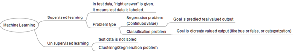
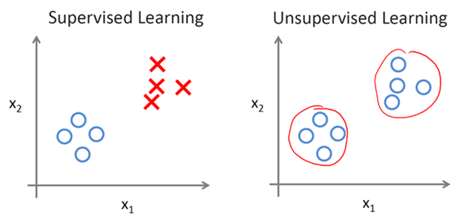

Marchine Learning Basics
========================
Marchine Learning의 개념및 용어 정리

## Marchine Learning 정의
기계가 일일이 코드로 명시하지 않은 동작을 데이터로부터 학습하여 실행할 수 있도록 하는 알고리즘을 개발하는 연구 분야이다. (1959년 아서 사무엘)

* Marchine Learning의 사례
  - 이메일 스팸 필터링 시스템
  - 쇼핑몰 이나 영화 연관 추천 시스템
  - 연관 검색어 처리
  - 문자 인식

이미지 이외에 다른 학습 종류들도 있다.

## Marchine Learning 학습 종류

### Supervised Learning(지도 학습)
  __learning with labeled examples - training set__

  사람이 교사로써 각각의 입력(x)에 대해 레이블(y)을 달아놓은 데이터를 컴퓨터에 주면 컴퓨터가 그것을 학습하는 것이다. 학습에 사용되는 데이터에 결과(label)가 정해져 있는 경우를 Supervised Learning(지도 학습)이라고 한다. 다른 말로 training set이라고 한다.
  지도 학습에는 분류(Classification)와 예측(Regression)이 있다.
  - 예측(Regression)은 데이터를 대표하는 선형모델 등을 만들고 그 모델을 통해 미래의 사건을 예측하는 것이다.

  - 분류(Classification)는 이전까지 학습된 데이터를 근거로, 새로운 데이터가 기존에 학습된 데이터에  분류가 되냐 안되냐를 판단 할 수 있다.
  예시) 페이스북이나 구글 포토의 얼굴 인식: 페이스북에 사진을 올리면 친구 얼굴 위에 이름이 자동으로 달리고는 하는데, 이것 역시 기계학습을 이용한 것. x가 이미지 픽셀, y가 사람 이름인 경우.

  예를 들면, 사람이 강아지 이미지를 모아서 주고 그 이미지 데이터가 고양이라는 레이블이 달려있는 자료를 가지고 학습을 하는 것이다. 즉, 결과를 알려주고 학습을 시키는 방법이다.

    

### Unsupervised Learning(비지도 학습)
사람 없이 컴퓨터가 스스로 레이블 되어 있지 않은 데이터에 대해 학습하는 것을 Unsupervised Learning(비지도 학습)이라고 한다. 레이블(y)없이 입력(x)만 이용해서 학습하는 것이다. 통계학의 군집화와 분포추정 등의 분야와 밀접한 관련이 있다
- 군집화(Clustering)은 데이터가 쭉 뿌려져 있을 때 레이블이 없다고 해도 데이터간 거리에 따라 대충 두 세개의 군집으로 나눌 수 있다. 이렇게 x만 가지고 군집을 학습하는 것이 군집화 이다.

- 분포추정(Underlying Probability Density Estimation)은 군집화에서 더 나아가 데이터들이 쭉 뿌려져 있을 때 얘네들이 어떤 확률 분포에서 나온 샘플들인지 추정하느 문제이다.

__지도 학습(Supervised)과 비지도 학습(Unsupervised)의 차이점(Graph)__
- 지도 학습 : 데이터 라벨링이 되어 있다.
- 비지도 학습 : 데이터 라벨링이 되어 있지 않다.(군집화)

### Semisupervised Learning(반지도 학습)
레이블이 있는 데어터와 없는 데이터 모두를 활용해서 학습하는 것이다. 다수의 레이블 없는 데이터를 약간의 레이블 있는 데이터로 보충해서 학습하는 종류의 문제를 다룬다.

### Reinforcement Learning(강화 학습)
위의 두 문제의 분류는 지도의 여부에 따른 것이었는데, 강화학습은 현재의 상태(state)에서 어떤 행동(Action)을 취하는 것이 최적인지를 학습하는 것이다. 행동을 할때 마다 외부 환경에서 보상(Reward)이 주어지는데, 이러한 보상을 최대화 하는 방향으로 학습이 진행된다. 그리고 이러한 보상은 행동을 취한 즉시 주어지지 않을 수도 있다(지연된 보상). 시스템을 제대로 보상하는 것과 관련된 __신뢰 할당 문제__ 가 있다. 그래서 나중에 얻을 값을 포함한 보상값의 총 합이 최대화되는 지 모르기 때문에, 미래를 고려하면서 가장 좋은 Action이 뭔지 여러 방식으로 수행하면 고민해야 한다. 위 방법들과는 다르게 실시간으로 학습을 진행하는 게 일반적이다.

### Marchine Learning - Diagram

### Marchine Learning 주요 알고리즘

#### * Supervised Learning (지도 학습)

- __Regression__
  + Linear Regression
  + Locally weighted linear regression
  + Ridge
  + Lasso
- __Classification__
  + kNN
  + Naive Bayes
  + Support Vector machine
  + Decision tree

#### * Unsupervised Learning (비지도 학습)

- Clustering
- K means
- Density estimation
- Expextion maximization
- pazen window
- DBSCAN

#### 참고 문서
* http://hunkim.github.io/ml/
* https://namu.wiki/w/%EA%B8%B0%EA%B3%84%ED%95%99%EC%8A%B5
* http://chapter5k.blogspot.kr/2016/01/supervised-learning-unsupervised.html
