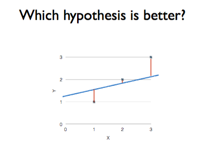

Linear Regression(선형회귀)
=================
2차원 좌표에 분포된 데이터를 1차원 직선 방정식을 통해 표현되지 않은 데이터를 예측하기 위한 분석 모델이다. 간단하게 xy축 좌표계에서 직선을 그렸다 생각하면 된다.

## 회귀분석
점들이 퍼져있는 형태에서 패턴을 찾아내고, 이 패턴을 활용해서 무언가를 예측하는 분석이다. 새로운 표본을 뽑았을 때 평균으로 돌아가려는 특징이 있기 때문에 붙은 이름이다.

## Hypothesis (가설)
Hypothesis h는 Feature를 넣으면 Targeted value를 계산해주는 일종의 공식이다. Linear Regression에서 사용하는 1차원 방정식을 가리키는 용어이다. 수식에서는 h(x), H(x)로 표현된다.

H(x) = Wx + b에서 Wx + b는 x에 대한 1차 방정식으로 직선을 표현한다. 기울기인 W(weight)와 절편인 b(bias)가 반복되는 과정에서 계속 바뀌고, 마지막 루프에서 바뀐 최종값을 사용해서 데이터 예측(prediction)에 사용된다. 최종결과로 나온 가설을 모델(model)이라 하며, "학습되었다"라고 한다. 학습된 모델은 배포되어서 새로운 학습을 통해 수정되기 전까지 지속적으로 활용된다.

왼쪽 그림을 보면, 노랑, 파랑, 빨강의 직선이 3개가 그려져 있다. xy 좌표에서 데이터는 (1,1), (2,2), (3,3)에 3개가 있는 상태이다. 가장 좋은 직선을 찾으라 하면 파랑색 직선이다.
하지만, 어떤 데이터가 있는지도 모르는 상태에서 파랑색 직선이 좋은 직선이라고 단정 지을 수 없다. 이 때, 오른쪽 그림을 보면 왼쪽의 그림과 달리 직선의 기울기와 절편이 조금 달라졌다. 여기서의 파랑색 직선은 왼쪽 그림에서 노랑이거나 빨강일 수도 있고, 실제로는 모든 직선이라고 보면 된다. 우리가 찾으려는 직선은 모든 데이터를 관통하면 가장 좋겠지만, 다양하게 퍼져있는 데이터에 대해 그런 상황은 거의 불가능하다. 그래서, 데이터에 가장 가깝게 그려지는 직선을 찾는 것이 목표가 된다.

## Cost (비용)
Hypothesis 방정싱에 대한 Cost(비용)로 방정식의 결과가 크게 나오면 좋지 않다고 얘기하고, 루프를 돌 때마다 W와 b를 비용이 적게 발생하는 방향으로 수정하게 된다. 놀랍게도 미분이라는 수학 공식을 통해 스스로 최저 비용을 찾아가게 된다. 즉, 직선으로 부터 각각의 데이터(좌표)까지의 거리 합계를 계산한 것을 Cost라고 부르고, 이 값이 가장 작은 직선을 찾는 것이 목표이다.

## Cost function (비용 함수)
Hypothesis 방정식을 포함하는 계산식이고 현재의 기울기(W)와 절편(b)에 대해 Cost(비용)을 계산해 주는 함수이며, 매번 호출할 때마다 반환값으로 표현되는 비용이 줄어들어야 한다. 지금 Linear Regression에서는 최소 비용을 검색하는 역활을 한다.
Cost function을 이용하여 가설함수의 정확성을 알수 있다. 다른 이름으로는 Squared error function 혹은 Mean squared error라는 이름을 가지고 있다.

위의 이미지 2장은 어떻게 직선으로부터 데이터가 위치한 좌표까지의 거리가 가까운지 판단하는 방법이다. 직선으로 표현하고 있지만, 이것은 x축에 대한 y값을 갖는 3개의 좌표라고 보면 좋다. 수직선을 내리거나 올려서 직선에 닿는 y좌표를 계산하면 공정한 거리를 얻을 수 있다.

왼족 그림에선 y를 빼는 데에는 H(x)에 포함된 모든 x만큼의 계산이 포함되어 있다. 즉, 뺄셈 1회가 아니라 3회를 하게 된다. 오른쪽 그림을 보면, H(x(1)) - y(1)이라고 하는 표현식은 x의 1번째 데이터를 입력했을 때의 Hypothesis(방정식) 결과에서 y의 1번째 데이터를 뺐다는 뜻이다. 위의 그림만으로 판단하면은 x의 1번째는 1이고, y의 1번째도 1이다. 하지만, W 와 b가 모호하기 때문에 정확한 결과값을 볼 수는 없다.

Hypothesis의 결과에서 y를 뺀 다음에 제곱을 하는 이유 2가지
(통계에서 표준편차와 분산이 무엇인지 참고하면 알수 있다.)

1. 뺄셈을 하게 되면 직선 위치에 따라 음수와 양수가 섞여서 나와서 계산이 귀찮해진다.
2. 제곱을 하면 가까운 데이터는 작은 값이 나오고, 멀리 있는 데이터는 큰 값이 나오기 때문에 멀리 있는 데이터에 Penalty(벌점)을 부과 할 수 있다.

최종적으로 좌표가 3개 이므로, 3으로 나눈다. 나누지 않는다면 데이터가 많은 경우 값이 엄청나게 커지게 되고 이후 계산이 복잡해지기 때문이다. 평균을 내기 위해 합계를 구한 다음 갯수로 나눈것과 같다고 생각 하면 된다. ∑(시그마)는 오른쪽 식에 대해 1부터 m번째 까지를 적용한 합계를 뜻한다. 만약 시그마를 사용하지 않으면 위쪽에 표현된 복잡한 계산식을 다 써야 하고, 데이터가 100개쯤 되면 쓸 방법도 없게된다. 
