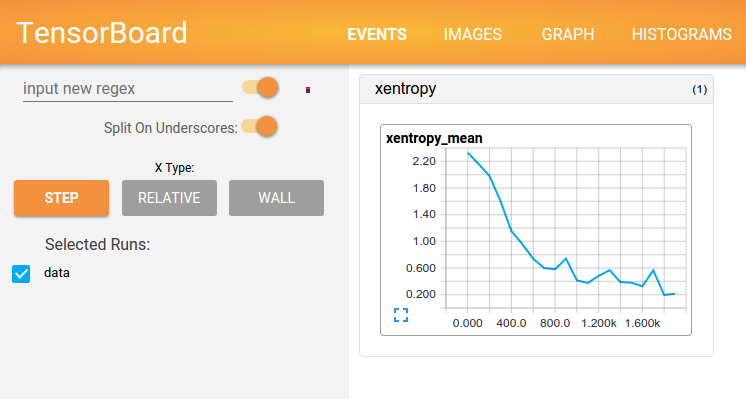

TensorFlow Basic
================
TensorFlow의 개념과 설치 방법

## TensorFlow 란?
TensorFlow(텐서플로우)는 Marchine Learning과 Deep Learning을 위해 구글에서 만든 오픈소스라이브러리이다. Data Flow Graph (데이터 플로우 그래프)방식을 사용였다.


## Data Flow Graph (데이터 플로우 그래프)
Data Flow Graph는 수학 계산과 데이터의 흐름을 Node(노드)와 Edge(엣지)를 사용한 방향 그래프(Directed Graph)로 표현한다.


Node(노드)는 수학적 연산(계산, Operation), 데이터 입/출력, 데이터 읽기/저장 등의 작업을 수행한다. Edge(엣지)는 노드들 간 데이터의 입출력 관계를 나타낸다.

Edge(엣지)는 동적 사이즈의 다차원 데이터 배열(=텐서)을 실어나르는데. 여기에서 텐서플로우라는 이름이 지어졌다.

> Tensor(텐서)는 과학과 공학 등 다양한 분야에서 전부터 쓰이던 개념이다. 수학에서는 임의의 기하 구조를 좌표 독립적으로 표현 하기 위한 표기법으로 알려져 있지만, 분야마다 다른 의미로 사용되고 있다. TensorFlow에서는 학습 데이터가 저장되는 다차원 배열이라고 생각하면 이해하기 쉽다.

## 특징

- Data Flow Graph를 통한 풍부한 표현력
- 코드 수정 없이 CPU/GPU 모드로 동작한다.
- 아이디어 테스트에서 서비스 단계까지 이용 가능하다.
- 계산 구조와 목표 함수만 정의하면 자동으로 미분 계산을 처리한다.
- python/C++를 지원하고,SWIG를 통해 다양한 언어 지원 가능

> "구글이 텐서플로우를 오픈소스로 한 것은, 기계 학습이 앞으로 제품과 기술을 혁신하는데 가장 필수적인 요소라고 믿기 때문입니다." - Google Brain Team


## TensorFlow Install
설치 방법및 프로그램 설치 링크(영문자료)

https://www.tensorflow.org/install/

### Linux 설치
- https://www.tensorflow.org/install/install_linux

### Windows 설치
- https://www.tensorflow.org/install/install_windows
- https://brunch.co.kr/@mapthecity/15 (내가 사용한 방법)

### Mac OSX 설치
- https://www.tensorflow.org/install/install_mac


## Hello TensorFlow!
설치가 잘 되었는지 예제 코드로 확인

```
$ python

>>> import tensorflow as tf
>>> hello = tf.constant('Hello TensorFlow!')
>>> sess = tf.Session()
>>> print(sess.run(hello))
결과 : Hello TensorFlow!

>>> a = tf.constant(10)
>>> b = tf.constant(20)
>>> print(sess.run(a+b))
결과 : 42
```


## 기본 용어

### Operation(오퍼레이션)
그래프 상의 노드는 오퍼레이션(op)으로 불린다. Operation(오퍼레이션)은 하나 이상의 Tensor(텐서)를 받을 수 있다. Operation(오퍼레이션)은 계산을 수행하고, 결과를 하나 이상의 Tensor(텐서)로 반환할 수 있다.

### Tensor(텐서)
내부적으로 모든 데이터는 텐서를 통해 표현된다. Tensor(텐서)는 일종의 다차원 배열인데, 그래프 내의 Operation 간에는 Tensor만이 전달된다.

### Session(세션)
그래프를 실행하기 위해서는 Session 객체가 필요하다. Session은 Operation의 실행 환경을 캡술화 한 것이다.

### Variables(변수)
변수는 그래프의 실행시, 파라미터를 저장하고 갱신하는데 사용된다. 메모리 상에서 Tensor를 저장하는 버퍼 역활을 한다.


### 예제
기본 개념 이해를 위한 예제

```
import tensorflow as tf

# 변수를 0으로 초기화
state = tf.Variables(0, name="counter")

# state에 1을 더할 오퍼레이션 생성
one = tf.constant(1)
new_value = tf.add(state, one)
update = tf.assign(state, new_value)

# 그래프는 처음에 변수르 초기화해야 한다. 아래 함수르 통해 init 오퍼레이션을 생성한다.
init_op = tf.iniitialize_all_variables()

# 그래프를 뛰우고 오퍼레이션들을 실행
with tf.Session() as sess:
  # 초기화 오퍼레이션 실행
  sess.run(init_op)
  # state으 초기 값을 출력
  print(sess.run(state))
  # state를 갱신하는 오퍼레이션을 실행하고, state를 출력
  for _ in range(3):
    sess.run(update)
    print(sess.run(state))
```

__결과__

```
0
1
2
3
```


## Tensor Board
텐서플로우를 사용해서 딥뉴럴 넷 같은 복잡한 계산을 할 때는 학습 과정이 복잡하고 이해하기 어렵다. 이때 Tensor Board를 사용하면 복잡한 학습 과정을 시각화하여 볼 수 있다.


### 참고 문서

- https://gist.github.com/haje01/202ac276bace4b25dd3f
- http://pythonkim.tistory.com/8


>
